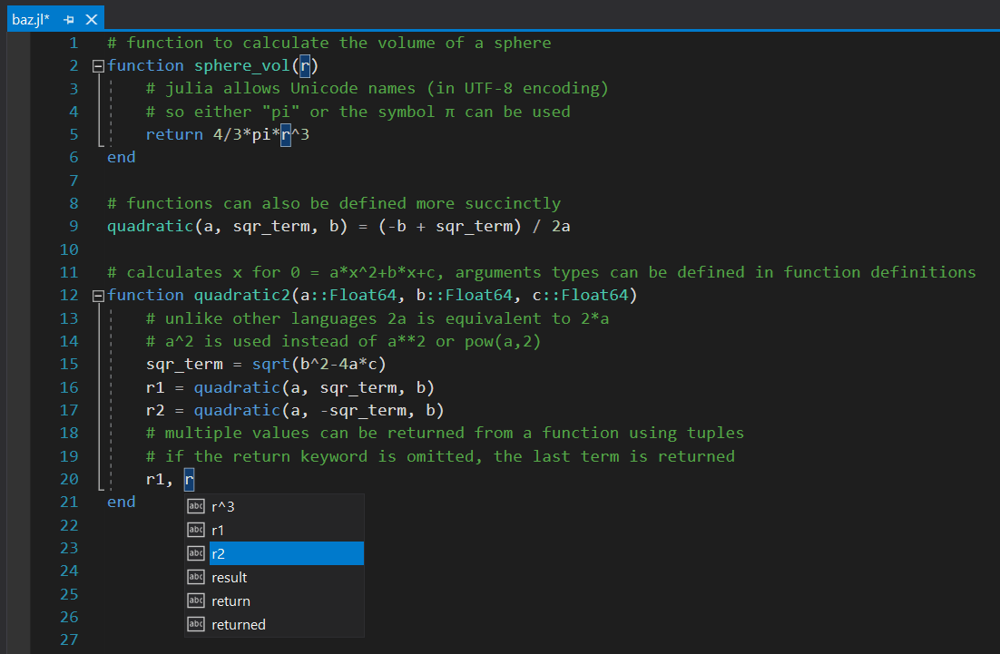
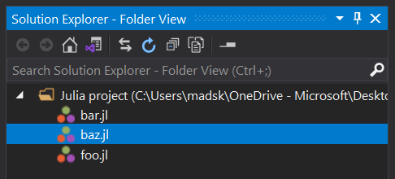

# Julia Language

Adding basic language support for Julia. Includes syntax highlighting, outlining, guidelines and symbolic auto-completion

Download the extension at the
[Visual Studio Marketplace](https://marketplace.visualstudio.com/items?itemName=MadsKristensen.julia)
or try the
[CI build](http://vsixgallery.com/extension/JuliaLanguage.f47f50eb-bd98-45d8-b90c-6182c76d816f/).

---------------------------------------

Basic language support for the Julia programming language.

**Features**:

* Syntax highlighting
* Code folding / outlining
* Auto completion
* Julia file icons

## License
[Apache 2.0](LICENSE)
